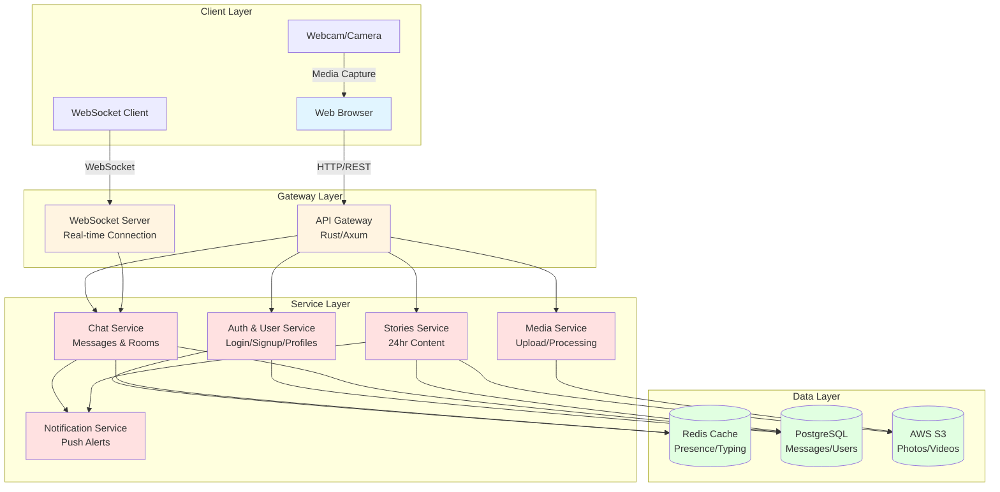
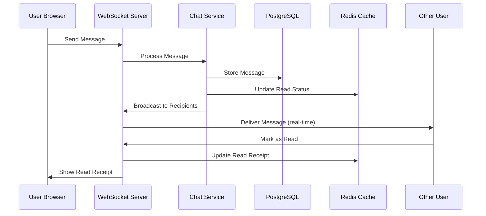
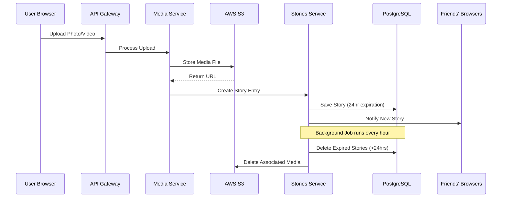
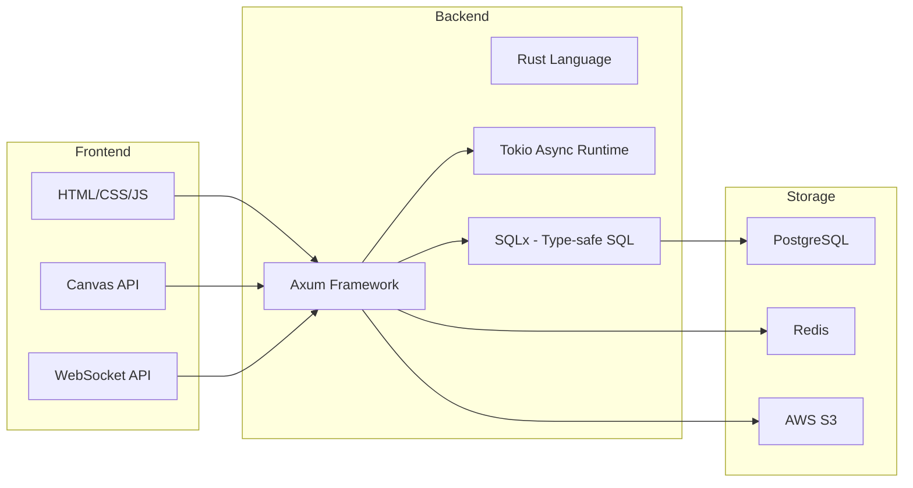
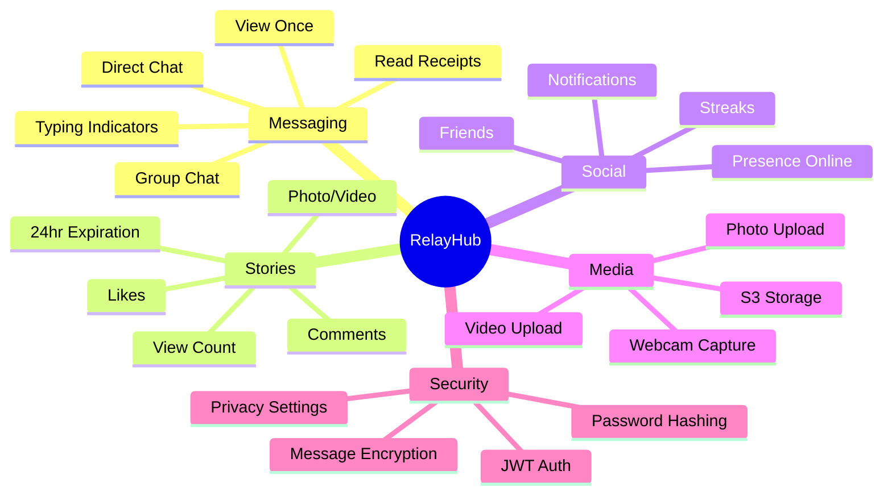
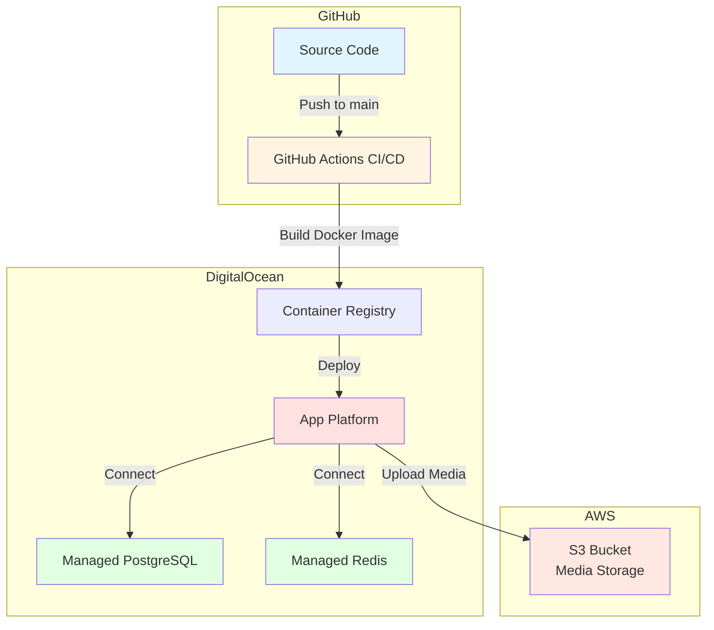

# RelayHub System Architecture Diagram

## Full System Architecture



## Message Flow Diagram



## Story Flow Diagram



## Technology Stack



## Feature Components



## Deployment Architecture



## How to View These Diagrams

1. **GitHub**: Push this file to GitHub - diagrams render automatically
2. **VS Code**: Install "Markdown Preview Mermaid Support" extension
3. **Online**: Copy the mermaid code to https://mermaid.live
4. **Export**: Use mermaid CLI to export as PNG/SVG

```bash
# Install mermaid CLI
npm install -g @mermaid-js/mermaid-cli

# Convert to PNG
mmdc -i ARCHITECTURE_DIAGRAM.md -o architecture.png
```
